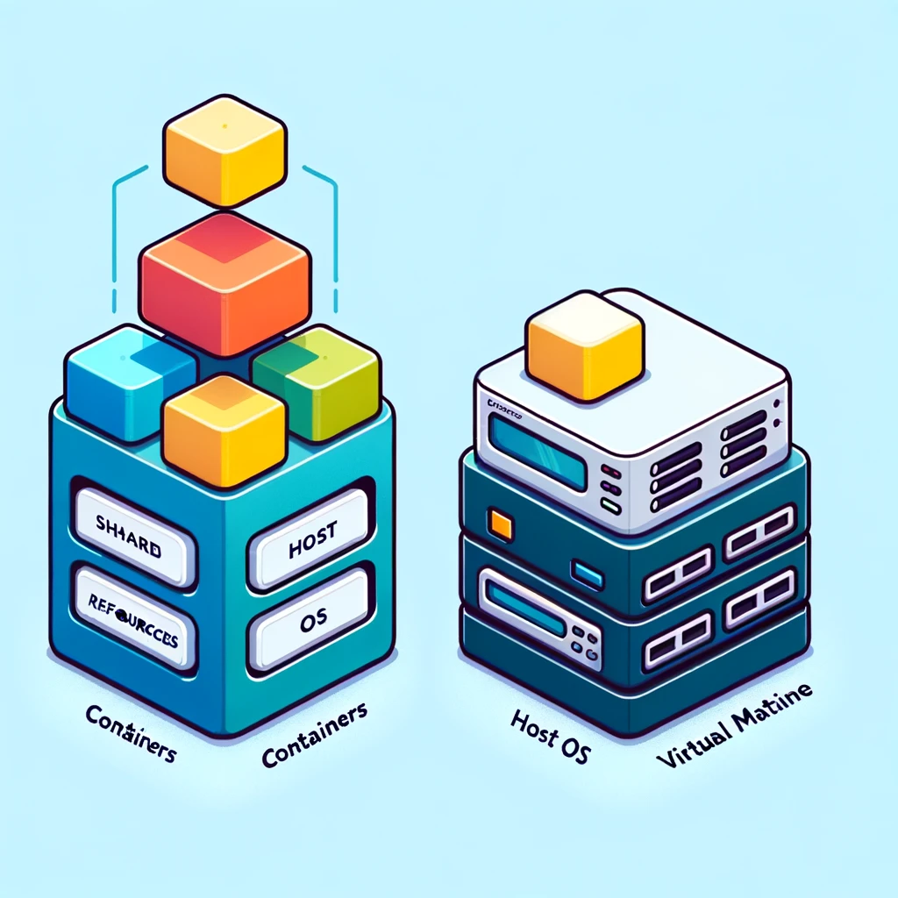
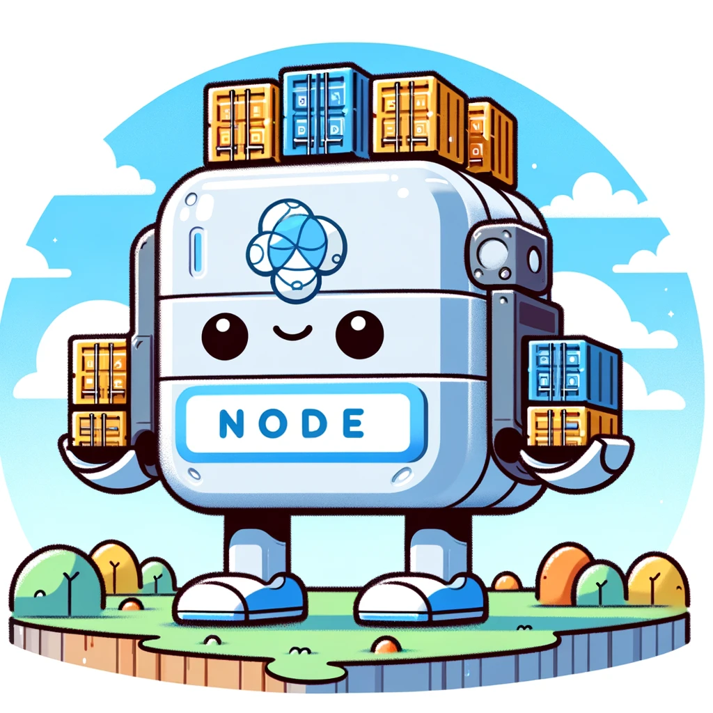
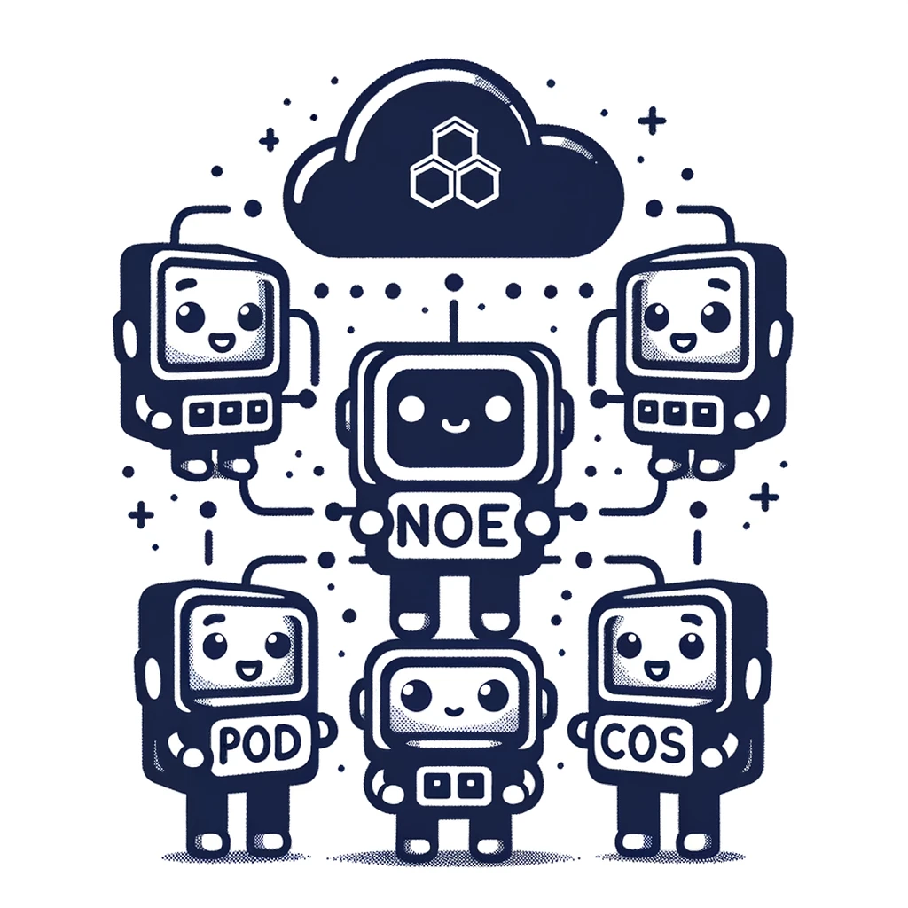
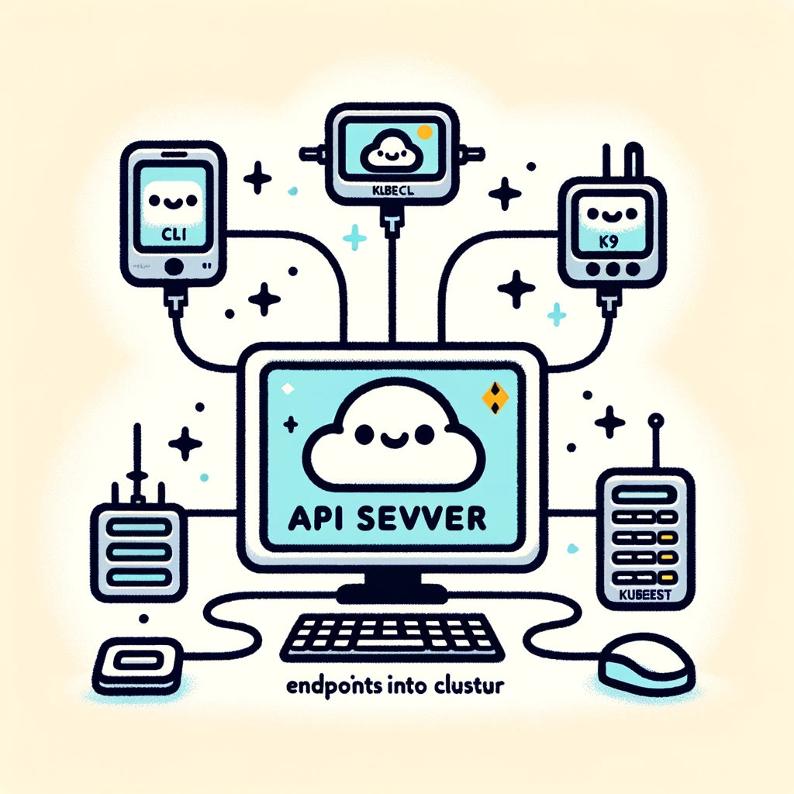
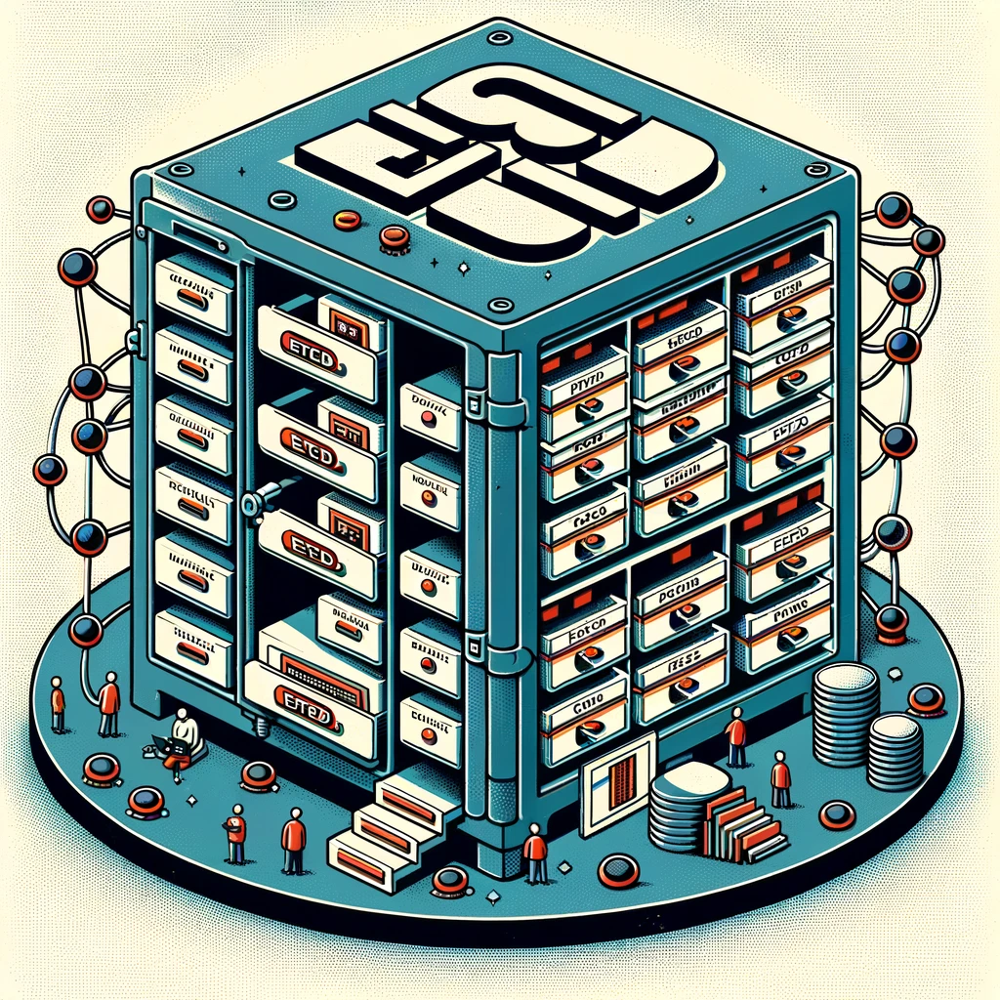
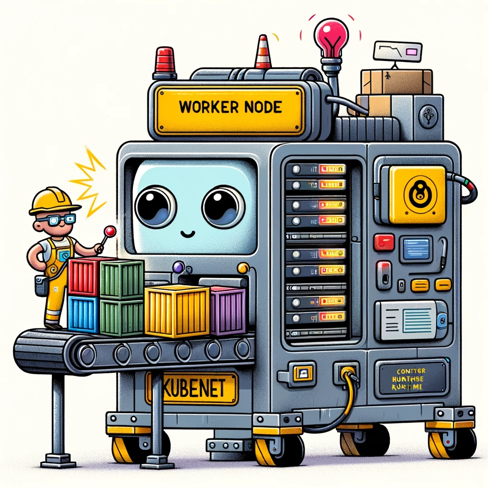
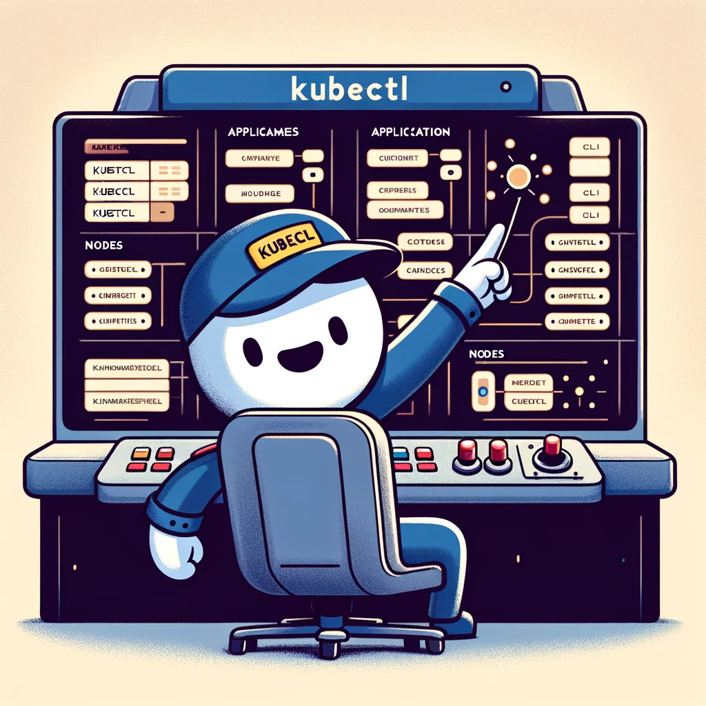
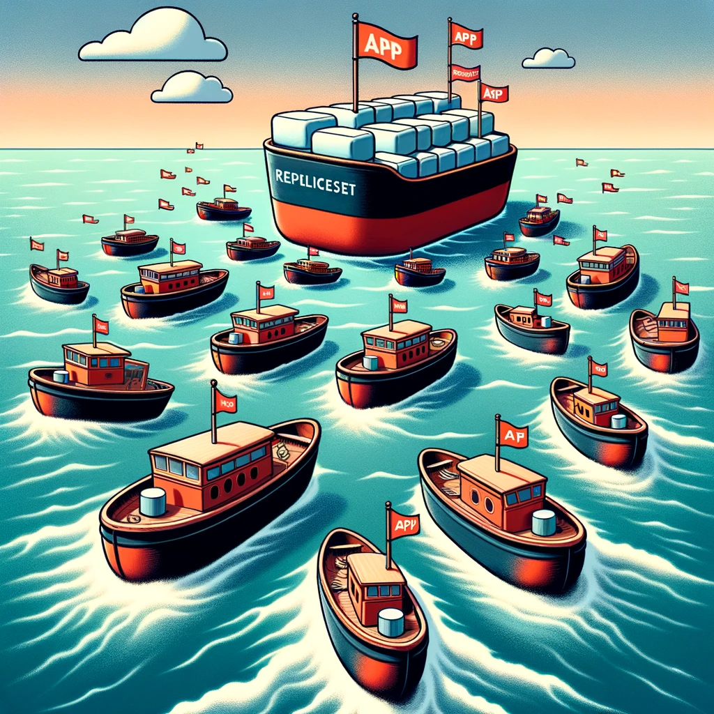
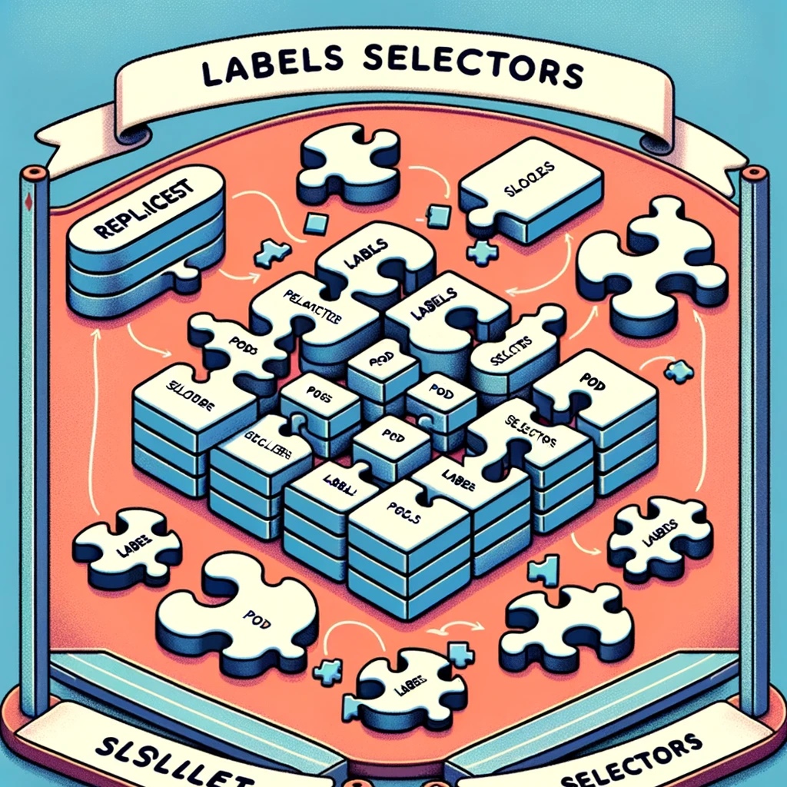
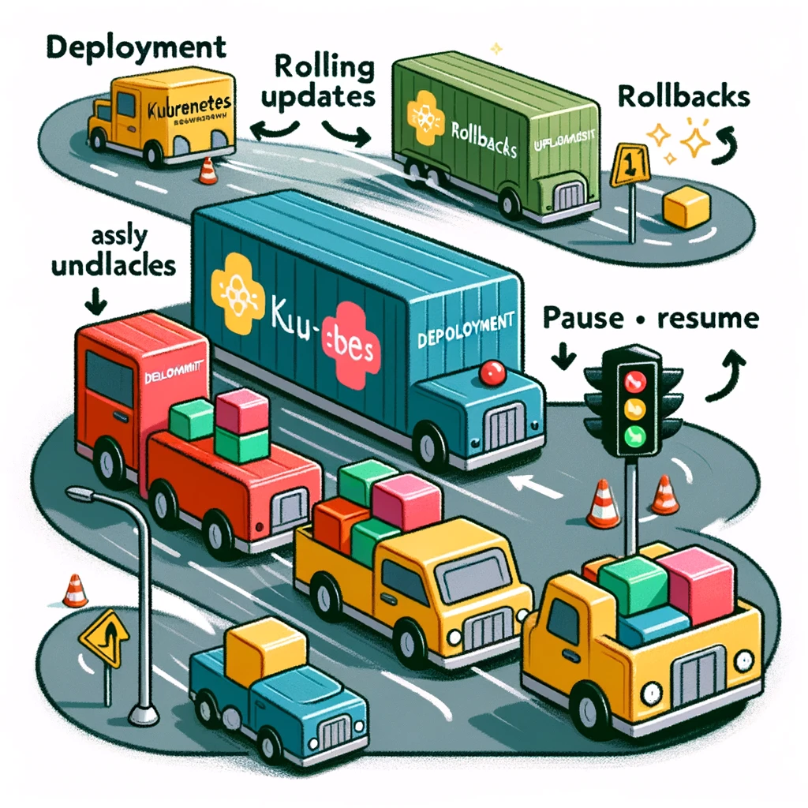

### Container - A LIGHTWEIGHT ENCAPSULATION OF AN APPLICATION
A container is a lightweight, standalone, and executable software package that includes everything needed to run a piece of software: code, runtime, system tools, system libraries, and settings. Containers are more resource-efficient than virtual machines, as they share the host system's kernel and do not require a full operating system for each instance, allowing for higher density and reduced overhead.


### Node - A HOST MACHINE
A Node is a machine, physical or virtual that is running Kubernetes. 
A worker machine where containers would be launched by Kubernetes.


### Cluster : GROUP OF MACHINES
A set of nodes grouped and networked together. A cluster helps with replicating container applications, so that if one node goes down, the application still lives, or instances can be adjusted based on load.


### Master Node : THE ORCHESTRATOR
The master node is responsible for Orchestration through running the Kubernetes Control Plane components which consist of:



1. **API Server : ENDPOINTS INTO CLUSTER**
   The API endpoints of Kubernetes. CLI tools such as `kubectl` and `k9s` communicates with these to output the state of the cluster.
   

   
2. **ectd service : CENTRALIZED DATABASE / STATE OF CLUSTER**
  Distributed key/value store of all data used to manage the cluster. Includes information on all the nodes and entities, and assures there is no conflicting info between master nodes.
  

  
3. **Scheduler : MANAGES CONTAINER LIFECYCLES**
   Distributes workloads on containers across multiple nodes. Assigns containers to nodes.
   


1. **Controller : THE BRAIN MAKES DECISIONS**
   The brain behind orchestration. Responsible for monitoring objects in the cluster and responding when nodes, containers go down. Makes decision to bring up new resources in such cases.


### Worker Node : RUNS CONTAINERS
The work node is responsible for running Containers and communicating its state with the master node.

1. **Container Runtime : SERVICE**
   the underlying software used to run containers. This used to be Docker but now it is `containerd`
   
2. **Kubelet : COMMUNICATOR**
   the agent that runs on each node in the cluster. The agent is responsible for making sure the containers are running on the nodes as expected.




### kubectl : CLI CLIENT FOR CLUSTER
The CLI tool used to deploy and manage applications on the Kubernetes cluster, to get cluster information, to get node status and manage many other resources.

### Dockerd vs Containerd

1. **Container Runtime Interface (CRI):** This is a standard protocol within Kubernetes that enables it to integrate with various container runtimes. It allows external vendors to develop their own container runtime solutions compatible with Kubernetes, as long as these solutions adhere to the specified requirements of the CRI.
    
2. **Open Container Initiative:** This is an industry standards organization that sets guidelines for container image and runtime specifications. It aims to establish a common standard for container formats and runtimes, ensuring compatibility and interoperability across different environments and platforms.
    
3. **Dockershim:** This is a component developed by Kubernetes to integrate Docker, a popular container runtime, into its ecosystem. Dockershim acts as an adapter, allowing Kubernetes to use Docker as its container runtime, even though Docker was not originally designed based on the CRI standard of Kubernetes.
   
4. **Containerd:** A lightweight container runtime within Docker, adhering to the CRI standard. Initially developed by Docker and subsequently donated to the CNCF, Containerd manages container lifecycles, image pulling, storage mounting, and networking on host machines.
   
5. **Docker Engine:** More than just a container runtime, Docker Engine offers a comprehensive suite including a robust CLI, API, image building tools, volume management, and security features.
   
6. **Dockershim Removal in Kubernetes 1.24:** Kubernetes version 1.24 saw the removal of Dockershim, transitioning towards direct integration with CRI-compliant container runtimes, eliminating the need for intermediary components like Dockershim.


> The image provides a clear and relatable visual analogy for a Pod in Kubernetes, depicting it as a shared living space where different characters (containers) utilize common resources, effectively conveying the concept of shared resources within a pod.
### Pods
A pod in Kubernetes is the smallest deployable unit, encapsulating one or more containers.

Containers in a pod ***share resources like storage and networking***. So, one container can refer to another port on localhost to connect to another container in the same pod.

For pod deployment, the prerequisites typically include:

1. A container image is already built and available.
2. A Kubernetes (K8s) cluster is set up and operational.

##### Multi containers
Containers within a pod represent distinct instances of an application. Multiple containers of different apps is a rare use case. But often in this case, a multi-container pod includes a container of the main application instance along with a container for each auxiliary helper service. To multiply these application instances, you scale up the pod's replicas, thus increasing each contained instance proportionally.

##### Using kubectl commands to run a new pod

`kubectl run nginx --image nginx` - create an nginx pod

###### *! REMEMBER: `kubectl run [POD-NAME]`*
This command is for running pods... you don't have to put the `pod` object in this command.

### Creating a Pod (and other objects) with YAML

A Kubernetes manifest, a definition file, always contains ***4 top/root level fields***:

1. `apiVersion` - the version of the Kubernetes API you're using to create the object
   Examples: `v1`,  `apps/v1`, `v2beta`, ect
   
2. `kind` - the type of object we are trying to make.
   Examples: `Pod`, `Service`, `ReplicaSet`, `Deployment`, ect
   
3. `metadata` - a dictionary with data about the object like:
	1. `name`
	2. `labels` - (itself, a dictionary of key/values that helps you query for the pod)
	   
4. `spec` - depending on the object we create, this specification field is where we provide additional information to Kubernetes pertaining to that object. This YAML data structure depends on the object (much like a particular JSON payload, or data you'd assign for a specific class in Java), so you may need to refer to the Kubernetes API Reference documentation to identify required fields.
   
   #### Pod Example:
   `pod-definition.yaml`
```
apiVersion: v1
kind: Pod
metadata:
  name: myapp-pod
  labels:
    app: myapp
    type: front-end
spec:
  containers: 
    - name: nginx-container
	  image: nginx
	- name: backend-container
	  image: redis
```
#### Using kubectl to create a pod with this spec
`kubectl create -f pod-definition.yml` - create pod from the YAML file

### Using kubectl to inspect pods after making them

###### LIST CURRENT RUNNING PODS
`kubectl get pods`

example output:
```
NAME            READY   STATUS             RESTARTS   AGE
pod             1/1     Running            0          15m
webapp          1/2     ImagePullBackOff   0          11m
```
Note that the `READY` column shows:
`running containers in pod / total containers in pod`

###### CHECK DETAILED INFO ON A SPECIFIC POD:
`kubectl describe pod`

You can find information like:
1. The number of containers operating within the pod.
2. The source container images for each container.
3. The node on which the pod is currently running.
4. A log of events, tracking the pod's status changes, like transitions to `Running` or issues like `ErrImagePull`.
   
example output:
```
Name:             redis
Namespace:        default
Priority:         0
Service Account:  default
Node:             controlplane/192.5.159.3
Start Time:       Fri, 01 Dec 2023 03:57:20 +0000
Labels:           run=redis
Annotations:      <none>
Status:           Pending
IP:               10.42.0.14
IPs:
  IP:  10.42.0.14
Containers:
  redis:
    Container ID:   
    Image:          redis123
    Image ID:       
    Port:           <none>
    Host Port:      <none>
    State:          Waiting
      Reason:       ImagePullBackOff
    Ready:          False
    Restart Count:  0
    Environment:    <none>
    Mounts:
      /var/run/secrets/kubernetes.io/serviceaccount from kube-api-access-bwbh9 (ro)
Conditions:
  Type              Status
  Initialized       True 
  Ready             False 
  ContainersReady   False 
  PodScheduled      True 
Volumes:
  kube-api-access-bwbh9:
    Type:                    Projected (a volume that contains injected data from multiple sources)
    TokenExpirationSeconds:  3607
    ConfigMapName:           kube-root-ca.crt
    ConfigMapOptional:       <nil>
    DownwardAPI:             true
QoS Class:                   BestEffort
Node-Selectors:              <none>
Tolerations:                 node.kubernetes.io/not-ready:NoExecute op=Exists for 300s
                             node.kubernetes.io/unreachable:NoExecute op=Exists for 300s
Events:
  Type     Reason     Age                 From               Message
  ----     ------     ----                ----               -------
  Normal   Scheduled  3m3s                default-scheduler  Successfully assigned default/redis to controlplane
  Normal   Pulling    90s (x4 over 3m3s)  kubelet            Pulling image "redis123"
  Warning  Failed     89s (x4 over 3m2s)  kubelet            Failed to pull image "redis123": rpc error: code = Unknown desc = failed to pull and unpack image "docker.io/library/redis123:latest": failed to resolve reference "docker.io/library/redis123:latest": pull access denied, repository does not exist or may require authorization: server message: insufficient_scope: authorization failed
  Warning  Failed     89s (x4 over 3m2s)  kubelet            Error: ErrImagePull
  Warning  Failed     77s (x6 over 3m2s)  kubelet            Error: ImagePullBackOff
  Normal   BackOff    66s (x7 over 3m2s)  kubelet            Back-off pulling image "redis123"
```

### Using kubectl to delete pods after making them

`kubectl delete pod/webapp`

### Edit an existing pod
If there is a given poddefintion file, edit it and use it to create new pod. Delete the existing running pod if necessary.

If a manifest is not given but we see the pod exists, we can:
###### Use kubectl to extract YAML from running pod
`kubectl get pod <pod-name> -o yaml > pod-defintion.yaml`

We can also:
###### Use kubectl to edit running pod
`kubectl edit pod <pod-name>`
Can only edit the following fields:
- spec.containers[*].image
- spec.initContainers[*].image
- spec.activeDeadlineSeconds
- spec.tolerations
- spec.terminationGracePeriodSeconds


> The image provides a visual analogy for a ReplicaSet in Kubernetes, representing it as a fleet of lifeboats to symbolize high availability, redundancy, load balancing, and scalability in maintaining continuous application access within a Kubernetes cluster.
### ReplicaSet
##### Problem Statement
If one pod runs our application and that pod or app fails, users will no longer be able to access our application... unless we have redundancy.

In other words, once we have ***replicated*** instances of our application running, if one container fails, the user won't loose access to the application since the app is running on another container.

###### Enables High Availability
Replication Controller/ReplicaSets manage the desired number of pod replicas. It continuously runs a reconciliation loop to compare the current number of pods against the desired count, adjusting as needed. For a single pod requirement, set replicas to 1; then if this pod fails, the controller will replace it. Similarly, for multiple replicas, adjust the desired count accordingly in the Replication Controller/ReplicaSet.

###### Enables Scalability and Load Balancing
The Replication Controller/ReplicaSets can span the whole cluster, meaning if resources to run desired replicas runs low on one node, the controller can boot up pods on another node in the cluster. You can also use other objects, like Horizontal Pod Autoscalers, to dynamically adjust the replica counts in response to incoming traffic to achieve load balancing.

### ReplicaSets
This is the new concept ("new"... I mean it came out in 2016 in v1.2...) that is preferred and functionally replaces Replication Controller. It is a kind of object in k8s that declares the desired count of replicas for a pod in the cluster. Compared to Replication Controller, it offers more selector capabilities. For instance, a ReplicaSet can use set-based selectors (like selecting by environment: production, development) which is not possible with Replication Controllers. For example:
```
apiVersion: apps/v1
kind: ReplicaSet
metadata:
  name: nginx-replicaset
  labels:
    app: nginx
spec:
  # has added benefit of using selectors to target pods with specific labels
  selector:
    matchLabels:
      app: nginx
```
ReplicaSets are also the object that ***Deployments*** abstract over. More on that soon.

### Embed Template of Pod in ReplicaSet
In the `spec` within the YAML of a ReplicaSet , you create the pod definition inline under the `template` field, like so:
`nginx-replicaset.yaml`
```
apiVersion: apps/v1
kind: ReplicaSet
metadata:
  name: nginx-replicaset
  labels:
    app: nginx
spec:
  replicas: 3
  selector:
    matchLabels:
      app: nginx
  template:
    metadata:
      labels:
        app: nginx
    spec:
      containers:
      - name: nginx
        image: nginx:latest
        ports:
        - containerPort: 80
```
The pod spec has to be embedded as a template here so the ReplicaSet knows the definition of new pods it creates.
Note - you don't include the `apiVersion` or `kind` of the Pod under this template. These are inferred.

###### Create the ReplicaSet
`kubectl create -f nginx-replicaset.yaml

###### See the ReplicaSet
`kubectl get replicaset`
example output:
```
NAME                 DESIRED   CURRENT   READY   AGE
nginx-replicaset     3         3         3       15s
```

###### Replace the ReplicaSet
Say we wanted to update the replicas, increasing the count. We can bump up the number of replicas in the manifest, then use kubectl's replace command to replace the replicaset:

`kubectl replace -f nginx-replicaset.yaml`

###### Scale up the ReplicaSet
We can also use a scale command in kubectl to bump up the replicas number...

With continuing to reference the manifest file:
`kubectl scale --replicas=6 -f nginx-replicaset.yaml`

Or by targeting the resource in the cluster by its kind and name:
`kubectl scale --replicas=6 replicaset nginx-replicaset`



> The image created offers a visual representation of Labels and Selectors in Kubernetes, using a puzzle game analogy to illustrate the relationship between Pods and ReplicaSets, emphasizing the matching of labels with selectors for effective pod management.
### Labels and Selectors
ReplicaSets depend on selectors to know which Pods to monitor, based on the Pod's labels. You must set up a selector in the ReplicaSet and match it with the labels in the Pod spec, even though you already define pod spec inline within the ReplicaSet.
```
apiVersion: apps/v1
kind: ReplicaSet
metadata:
  name: nginx-replicaset
  labels:
    app: nginx
spec:
  replicas: 3
  selector:
    matchLabels:
      app: nginx # label to match in the pod spec
  template: # will template in the PodSpec
    metadata:
      labels:
        app: nginx # here is the label on the Pod that selector targets
```

Beyond ReplicaSets, selectors are used in other objects in Kubernetes. Here are some examples and how they use selectors:

1. ***Deployments:*** Use selectors to link to ReplicaSets, which manage pods for updates and rollbacks.
    
2. ***Services:*** Employ selectors to direct network traffic to the right pods for load balancing and discovery.
    
3. ***DaemonSets:*** Utilize selectors to ensure specific pods run on every node.
    
4. ***StatefulSets:*** Use selectors for managing stateful applications, ensuring ordered deployment and unique identifiers for pods.
    
5. ***Jobs and CronJobs:**** Apply selectors to track and manage pods for task execution and scheduled jobs.
    
6. ***Horizontal Pod Autoscaler (HPA):*** Uses selectors to identify and automatically scale pods based on CPU/memory usage or custom metrics.


### Deployments

Deployments expand upon ReplicaSets. Deployments will enable many instances of the application needed to run, and they add some extra abilities on top:
1. **Rolling Updates** - When newer versions of the app become available, the instances can be updated one at a time so that some instances are still constantly available for users to access.
2. **Rollbacks** - If there are any issues with the updates, the changes that were carried out can be easily reverted.
3. **Pause and Resume changes** - you can pause the environment and resume it so all changes are rolled out together.


> *The illustration uses a garden divided into different sections, each representing a Kubernetes Namespace, to effectively convey the concept of organizing and managing resources within separate namespaces for better organization and isolation in a Kubernetes cluster.


> Here's another illustration. The graphic illustrates the concept of Kubernetes Namespaces as different family houses in a neighborhood, each with its unique resources and rules, effectively conveying how Namespaces function as separate environments within a Kubernetes cluster.
### Namespaces
Kubernetes namespaces are a way to ***divide cluster resources*** between multiple users and applications. They provide a scope for names, allowing resources like pods, services, and deployments to be named uniquely within the namespace but potentially reused across different namespaces. This organization aids in managing environments within the same cluster, such as development, staging, and production, or separating resources between different teams or projects. Namespaces help streamline resource management, access control, and resource allocation within a Kubernetes cluster.

##### `default` Namespace
Kubernetes automatically creates a `default` namespace.
###### *! REMEMBER*
If you don't specify a namespace to your `kubectl` commands, your actions will scope into this namespace.

##### `kube-system` Namespace
Kubernetes creates a set of pods and services for its internal functioning and puts this under the `kube-system` namespace.

##### `kube-public` Namespace
Resources available to all users should go here.

#### Examples
A common use case is that you create namespaces for the environment of a specific workload:

`webapp-dev`
`webapp-prod`

##### Benefit of Isolation
The resources will be isolated between these. This way, if a resource in the dev environment is modified, then it won't impact resources in the prod environment.

##### Scoped Policies
Each namespace can have its own unique policies. You can also assign resource limit quotas for a namespace so that a namespace is guaranteed a certain amount and does not use above its allowed limited.

#### DNS
If connecting a resource to another resource in the cluster, you can use a short hand for it's DNS name, for example:
`database-service`


